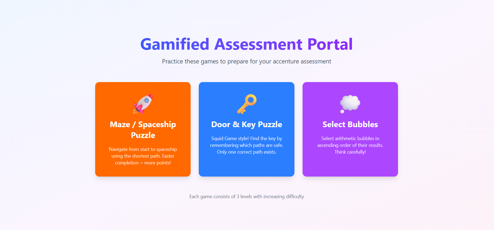
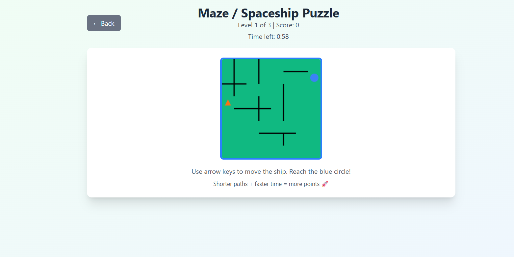
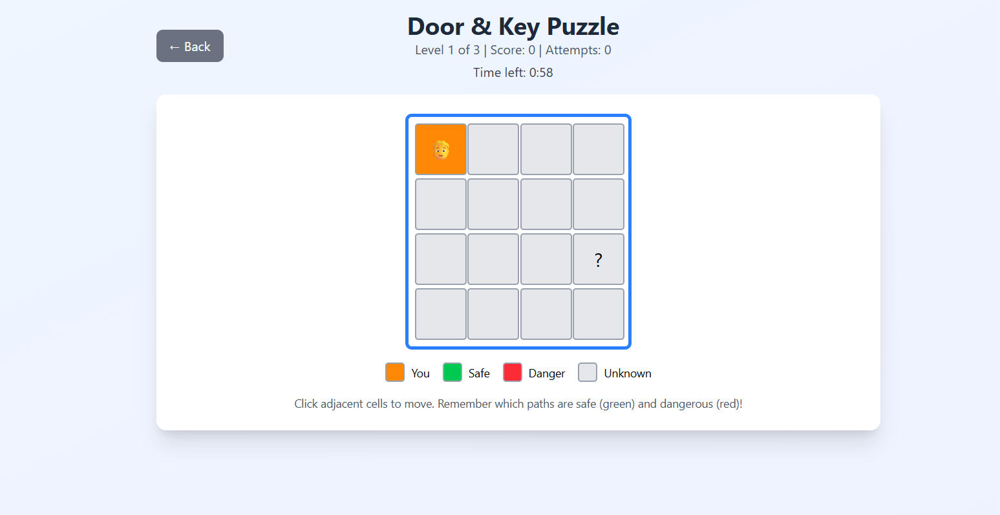
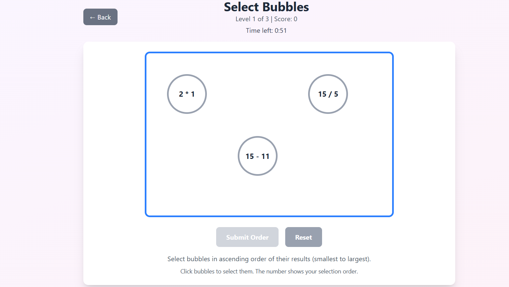

🧾 README.md
# 🎮 Gamified Assessment Portal

A fun and interactive web app designed to help students prepare for **Accenture-style online assessments** — through **mini-games** that test logic, focus, and speed 🚀.  
Built with **React + Tailwind CSS**, this portal brings a gamified touch to placement preparation.

---

## 🧠 Overview

The portal currently includes **three mini-games**, each designed to strengthen your problem-solving and logical thinking abilities in a playful way.

| Game | Description | Skills Tested |
|------|--------------|----------------|
| 🚀 **Maze / Spaceship Puzzle** | Navigate from start to goal by finding the shortest path before time runs out. | Spatial reasoning, planning |
| 🗝️ **Door & Key Puzzle** | Find the correct path to the key — only one is safe! Inspired by *Squid Game*. | Memory, pattern recognition |
| 💭 **Select Bubbles** | Select bubbles in ascending order of their computed values before time expires. | Arithmetic, speed, logical ordering |

Each game has **3 levels** with increasing difficulty.

---

## 🧩 Features

✅ Interactive UI built with **React**  
✅ Beautiful **TailwindCSS** design (dark & modern)  
✅ **Timer-based levels** for extra challenge  
✅ Dynamic **scoring system** (based on time and accuracy)  
✅ Smooth **game transitions** using `useState`  
✅ Fully responsive design

---

## 🖥️ Preview

Here’s a glimpse of the games in action 👇  

<p align="center">
  
  
</p>
<p align="center">
  
  
</p>

---

## ⚙️ Tech Stack

- **React.js** – component-based front-end  
- **Tailwind CSS** – styling and layout  
- **JavaScript (ES6)** – logic and DOM handling  
- **Vite** – fast development environment  

---

## 🚀 Getting Started

### 1️⃣ Clone the repository
```bash
git clone https://github.com/IamAkram321/accenture-gamified-assessment-portal-for-practice

2️⃣ Install dependencies
npm install

3️⃣ Run the development server
npm run dev

4️⃣ Open in your browser
http://localhost:5173

🧩 Folder Structure
src/
├── components/
│   ├── GameSelector.jsx
│   └── games/
│       ├── BubbleGame.jsx
│       ├── MazeGame.jsx
│       └── KeyGame.jsx
├── App.jsx
└── main.jsx

🕹️ Scoring System (Example)

Each level awards points based on:

Time bonus: Faster completion = more points

Level multiplier: Higher levels give more base points

Accuracy: Wrong selections reduce your bonus

🕛 Timer Details

Each game level gives 1 minute to complete

Auto-advances to the next level when time expires

✨ Future Improvements

 Add leaderboard system

 Add sound effects and animations

 Introduce new game modules

 Store player progress locally


Developed by: [MD AKRAM]

📜 License

This project is open-source under the MIT License
.